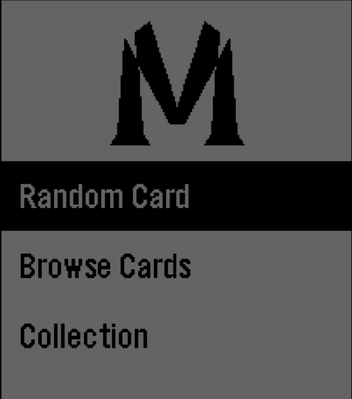
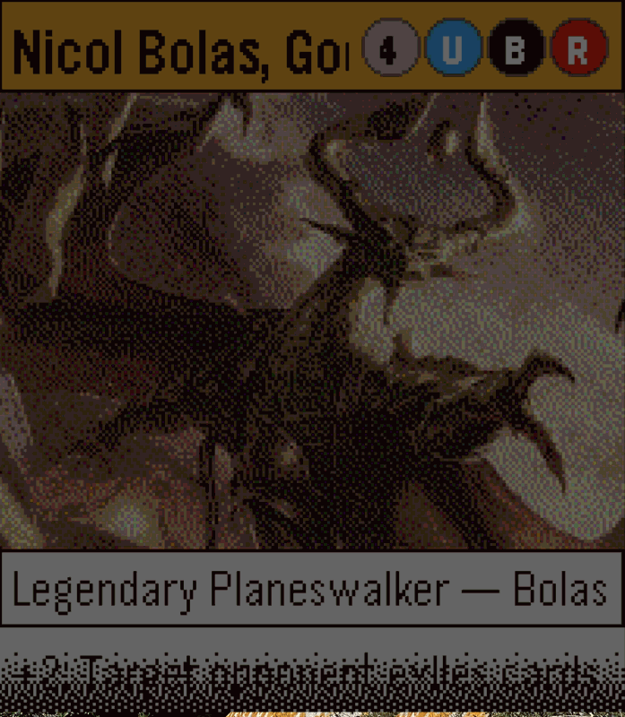
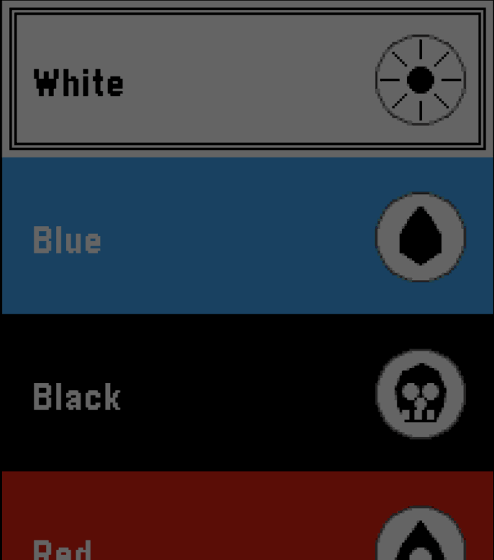

# Magic Pebble

*A Magic: The Gathering card viewer for your wrist.*

---

It has long been held — by people who hold things, and occasionally by the
sort of people who hold opinions about people who hold things — that the
single greatest obstacle to looking up the oracle text of *Dryad Arbor*
mid-conversation is having to pull out one's phone like some sort of common
civilian. This problem, which has plagued exactly seventeen people in the
recorded history of the universe, is now solved. By a watch.

Magic Pebble runs on the Pebble Time 2, a wristwatch which, by an
extraordinary coincidence of historical accident, has 200×228 pixels with
which to render the lavish illustrations of an entire fantasy multiverse.
This works approximately as well as you would imagine. The artwork is
squinted at rather than admired; the oracle text scrolls past in a font
slightly smaller than the patience of the average reader; and the mana
symbols are rendered as small coloured circles.

You cannot play Magic from this watch. Let us be very clear about that.
You cannot tap your wrist to declare an attacker, you cannot resolve the
stack by tilting it sideways, and pressing Select during your opponent's
upkeep will simply navigate to the next menu, which is not — despite
appearances — a legal game action. What you *can* do is browse some thirty
thousand cards, save a small selection of them into a "Collection" so you can
remember that card your buddy tells you about and occasionally produce a card you
had forgotten existed at precisely the moment when nobody asked. This is,
on balance, almost certainly enough.

So: why? Because it's possible and someone had to.

## Features

- **Random card** — one of roughly 30,000 cards, served up at random.
- **Browse by filter** — pick a colour, then a mana value, then a card type, then a letter range, then the *exact* letter. The Scryfall API does the heavy lifting; you do the heavy scrolling.
- **Card art** — yes, on Android. On iOS, the Pebble JS runtime does not provide a Canvas, so the art panel falls back to a tasteful diagonal hatch (see the iOS notes in `src/pkjs/index.js`).
- **Collection** — save cards you encounter into a small list on the watch. Press Select on the card view to add or remove; the list persists across launches.

## Screenshots





*(Screenshots forthcoming — drop yours into `docs/screenshots/`.)*

## Building

```bash
pebble build                       # produces build/magic-pebble.pbw
pebble install --emulator emery    # run in the emery (Pebble Time 2) emulator
# or, with a real watch paired to your phone:
pebble install --phone <phone-ip>
```

The project uses the Pebble SDK 3 WAF build system. Resources are declared in `appinfo.json` and live in `resources/`. The phone-side JavaScript that talks to the Scryfall API is in `src/pkjs/index.js`.

## Requirements

- Pebble SDK 3 (`pebble` CLI) with the `emery` platform installed
- A Pebble Time 2 (real or emulated)
- The Pebble companion app on your phone, with network access — the watch itself never talks to the internet, the phone proxies all Scryfall calls

## Credits

Card data, oracle text, and artwork via [Scryfall](https://scryfall.com) — thank you, Scryfall, you are a treasure. Magic: The Gathering is © Wizards of the Coast; this project is an unofficial fan tool and is not affiliated with, endorsed by, or otherwise blessed by Wizards.
