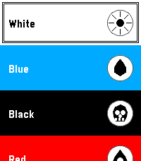

# Scryble

*A Magic: The Gathering card viewer for Pebble.*

---

You don't need this. Your phone can look up cards just fine. But when a buddy
mentions a card you've never heard of and you want to pull it up — or save it
before you forget the name — it's rather fun to do so from your wrist.

Scryble only runs on the Pebble Time 2. The artwork is squinted at rather than
admired, the oracle text scrolls in a font slightly smaller than ideal, and the
mana symbols are small coloured circles. You cannot play Magic from this watch.
What you *can* do is browse over thirty thousand cards and save a handful to an
on-watch collection. That turns out to be enough.

## Features

- **Random card** — one of ~31,700 unique cards (Scryfall, today), served up at random.
- **Browse by filter** — pick a colour, then a mana value, then a card type, then a letter range, then the *exact* letter. The Scryfall API does the heavy lifting; you do the heavy scrolling.
- **Collection** — save cards you encounter into a small list on the watch. Press Select on the card view to add or remove; the list persists across launches.

## Screenshots




## Building

```bash
pebble build                       # produces build/scryble.pbw
pebble install --emulator emery    # run in the emery (Pebble Time 2) emulator
# or, with a real watch paired to your phone:
pebble install --phone <phone-ip>
```

The project uses the Pebble SDK 3 WAF build system. Resources are declared in `appinfo.json` and live in `resources/`. The phone-side JavaScript that talks to the Scryfall API is in `src/pkjs/index.js`.

## Requirements

- Pebble SDK 3 (`pebble` CLI) with the `emery` platform installed
- A Pebble Time 2 (real or emulated)
- The Pebble companion app on your phone, with network access — the watch itself never talks to the internet, the phone proxies all Scryfall calls

## Known limitations

- **Double-faced cards** (transform, MDFC, etc.) currently show the placeholder art instead of the front face. Scryfall stores image URIs under `card_faces[0].image_uris` for these, and the pkjs companion only reads top-level `image_uris.art_crop`. Fix in `src/pkjs/index.js` (`cacheCard`).

## Credits

Card data, oracle text, and artwork via [Scryfall](https://scryfall.com) — thank you, Scryfall, you are a treasure. Magic: The Gathering is © Wizards of the Coast; this project is an unofficial fan tool and is not affiliated with, endorsed by, or otherwise blessed by Wizards.
